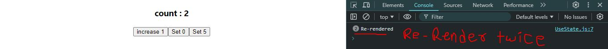

> to understand this concept we need to disable ReactStrict mode, because it logs the same console twice.

```javascript
import React, { useState } from 'react'

function UseState() {

    const [count, setCount] = useState(0);

    console.log("Re-rendered"); // will give message every time after component re-render

  return (
    <div>
    
    <h3>count : {count}</h3>
    <button onClick={()=> setCount( c => c+1)} >increase 1</button>
    <button onClick={()=> setCount(0)} >Set 0</button>
    <button onClick={()=> setCount(5)} >Set 5</button>
      
    </div>
  )
}

export default UseState
```
1. Idle state => **First Log Cleared**

⬇️

2. Idle state => **First Log Cleared** => **increase 1(1st)** => **increase 1(2nd)**
⬇️



