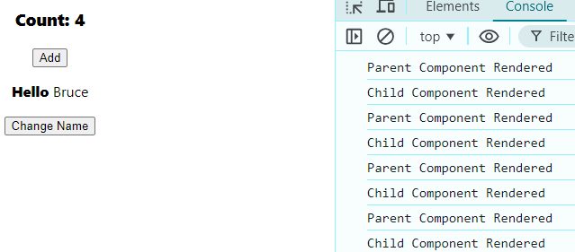

> Possible way we can use React.memo() in incorrect manner


# 1. using JSX as a child

## Parent
```javascript
import React, { useState } from 'react'
import { MemoriezedChildThree } from './Child_Three';

function Parent_Three() {

    const [count, setCount] = useState(0);
    const [name, setName] = useState("Bruce");


    console.log("Parent Component Rendered");
  return (
    <div>
    <h3>Count: {count}</h3>
    <button onClick={()=> setCount(c => c+1)} >Add</button>
    <MemoriezedChildThree name={name}>
        Hello
    </MemoriezedChildThree>
    <button onClick={()=> setName("Clark")} >Change Name</button>
      
    </div>
  )
}

export default Parent_Three
```
## Child
```javascript
import React from 'react'

function Child_Three({children, name}) {
    console.log("Child Component Rendered");
  return (
    <div>
      <p>{children} {name}</p>
    </div>
  )
}

export default Child_Three

export const MemoriezedChildThree = React.memo(Child_Three);
```
1. Idle state => **First Log Cleared** ➡️ **Add (X3)**  
⬇️  
  
2. Idle state => **First Log Cleared** ➡️ **Change Name (X5)**  
⬇️  
 
> this is a perfect & simple example of how to use React.memo()  
but some

```javascript
// import React, { useState } from 'react'
// import { MemoriezedChildThree } from './Child_Three';

// function Parent_Three() {

//     const [count, setCount] = useState(0);
//     const [name, setName] = useState("Bruce");

//     console.log("Parent Component Rendered");
//   return (
//     <div>

//     <h3>Count: {count}</h3>
//     <button onClick={()=> setCount(c => c+1)} >Add</button>
//     <MemoriezedChildThree name={name}>
    <strong>Hello</strong>
//     </MemoriezedChildThree>
//     <button onClick={()=> setName("Clark")} >Change Name</button>
      
//     </div>
//   )
// }

// export default Parent_Three
```
3. Idle state => **First Log Cleared** ➡️ **Add (X4)**  
⬇️  
 
> now React.memo() donot work as expected, moral here if child component have another child inside it we do not need to creater react memo from  

## Key Takeaways
1. Primitive value vs object
   A. When passing primitive values (like strings) as props, React.memo() can effectively prevent re-renders.  
   B. When passing complex objects or JSX elements (like <strong>Hello</strong>), React.memo() cannot optimize as effectively because a new reference is created on each render.  

2. Avoid wrapping complex children
   If a child component has complex structures (like JSX elements), and you want to optimize it using React.memo(), consider keeping those structures outside the memoized component or using React.memo() carefully.  

3. React.memo with Custom Comparators
   If you really need to pass a complex prop and want to control when the component re-renders, you can provide a custom comparison function to React.memo(). This function can help determine whether to re-render the component based on your own logic.
```javascript
export const MemoriezedChildThree = React.memo(Child_Three, (prevProps, nextProps) => {
    return prevProps.name === nextProps.name && prevProps.children.type === nextProps.children.type;
});
```

# 2. Using updating objects like date or Math.Random
> changing value intervally like __Date__ component(getHours, getMinutes, getSeconds) or __Math.Random()__ is not suggested to wrap inside React.memo() optimization.

## Parent
```javascript
import React, { useState } from 'react'
import { MemorizedPF } from './ChildFour';

function ParentFour() {
    const [count, setCount] = useState(0)
    const [name, setName] = useState("Bruce");
    console.log("Parent Component Rendered");
  return (
    <div>
    <h3>Count: {count}</h3>
    <button onClick={()=> setCount(c=>c+1)}>Add</button>
    <MemorizedPF name={name} />
    <button onClick={()=>setName("Clark")} >Change Name</button>
    </div>
  )
}

export default ParentFour
```

## Child
```javascript
import React from 'react'

function ChildFour({children, name}) {
    console.log("Child Component Rendered");
    const date = new Date();
  return (
    <div>
    <h3>{children} {name} {date.getHours()}:{date.getMinutes()}:{date.getSeconds()}</h3>
    </div>
  )
}

export default ChildFour

export const MemorizedPF = React.memo(ChildFour);
```
1. Idle state => **First Log Cleared** ➡️ **Random Multiple Events**  
⬇️  
 
-------------------------------
 

here the problem is, date & time is not changing after events.